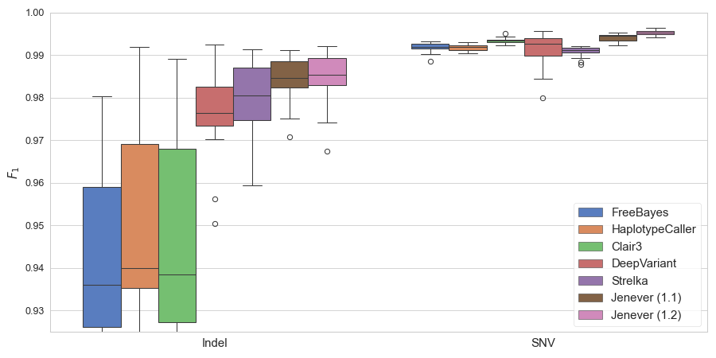
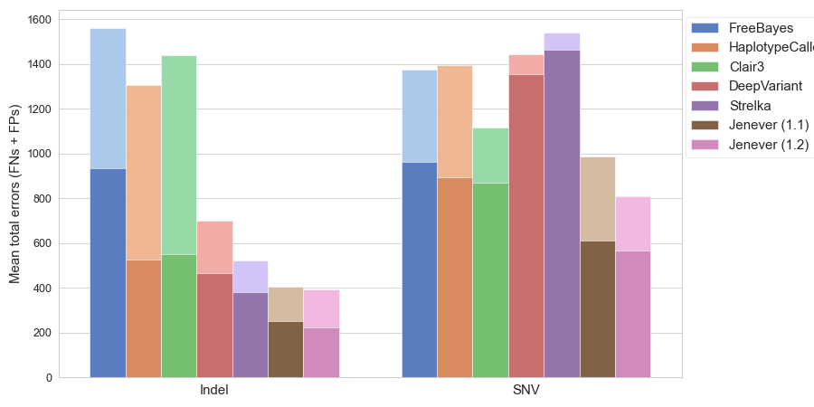

## NGS Variant detection with Generative Haplotype Prediction

This repo contains code for detecting variants from next-generation sequencing data (BAM / CRAM files)
 via generative haplotype prediction (see our [preprint](https://www.biorxiv.org/content/10.1101/2024.02.27.582327v1)).
Our model uses a deep transformer network to 'generate' haplotypes in the same manner as a modern Large Language Model (LLM), but instead of
word tokens, our model generates DNA sequence k-mers for both haplotypes. With this approach, there's not a need for
any sophisticated statistical procedures - no HMMs, no de Bruijn graphs, or decisions about mapping quality
quality cutoffs, read counts, allele frequencies, etc. The approach allows for true end-to-end deep learning
for variant detection.

### Warning!
The current Jenever model has been trained on Illumina WGS germline short-read data, and is not likely to work on hybrid-capture (e.g. exome), long read, somatic, or other types of genomic data. 

## What's new with version 1.3

Jenever 1.3 introduces better parallelization for the variant quality score calculation, leading to higher overall performance. We've also added progress bars for calling (you can disable with the `--no-prog` option), and done a lot of behind-the-scenes code cleanup and testing. Precision and recall statistics should be the same as for Jenever 1.2.

#### A note on Jovian

An earlier version of this tool, called Jovian, was made available in 2022 (see [preprint](https://www.biorxiv.org/content/10.1101/2022.09.12.506413v1) for details).
Jovian used a similar encoder architecture, but did not use autoregressive decoding, and had overall lower performance. 
The current version which uses autoregressive decoders to generate haplotypes is called Jenever. 

## Performance notes

A comparison of the $F_1$ statistic for Indels and SNVs across different models

The upper (pastel) portion is the mean total number of FPs per sample, and the bottom darker bar represents the mean total number of FNs. 

Jenever calls were filtered at quality 10 (phred-scaled), HaplotypeCaller at 50 , Clair3 at 0, DeepVariant at 3, and Strelka at 4, values that are close to the $F_1$-maximizing thresholds computed by $vcfeval$.
These accuracy statistics were computed by [hap.py](https://github.com/Illumina/hap.py) on held-out validation regions on chromosomes 21 and 22.
 

## Installation

#### Requirements

You'll need a linux / unix compatible system (MacOS is fine) with python >= 3.10 and pip installed. 

To install jenever, clone this repository, navigate to the repository directory, and enter: 

    pip install  .

on the command line. There are some pretty large dependencies (pytorch, pysam, sklearn, etc), so installation may take a few minutes.

It's a good idea to install in a separate conda environment or python virtualenv if possible, but not required unless there are dependency conflicts. 

### Model checkpoints

Transformer model checkpoints and variant quality models available from [this bucket](https://storage.googleapis.com/jenever-models/). You'll need to download a transformer model and a classifier model in order to use Jenever. Here is a table with the available models:

| Model file                                                                                                                       | Description                                                                                    |
|----------------------------------------------------------------------------------------------------------------------------------|------------------------------------------------------------------------------------------------|
| [bwa_ft_100M_run5_epoch80.model](https://storage.googleapis.com/jenever-models/bwa_ft_100M_run5_epoch80.model)                                                 | A model fine-tuned on BWA-aligned data, with improved performance for BWA data    |
| [good44fix_epoch280.model](https://storage.googleapis.com/jenever-models/good44fix_epoch280.model)                               | A new transformer model with better precision and sensitivity for SNVs                         |
| [g44e280_clf.model](https://storage.googleapis.com/jenever-models/g44e280_clf.model)                                             | A new classifier model trained with calls form the "good44fix" transformer                     |
| [100M_s28_cont_mapsus_lolr2_epoch2.model](https://storage.googleapis.com/jenever-models/100M_s28_cont_mapsus_lolr2_epoch4.model) | The v1.0  weights for the main transformer model, as used in the Jenever publication           |
| [s28ce40_bamfix.model](https://storage.googleapis.com/jenever-models/s28ce40_bamfix.model)                                       | The v1.0 classifier model, as used in the Jenever publication                                  |
| [paraclf.model](https://storage.googleapis.com/jenever-models/paraclf.model)                                                     | A classifier model trained on more data with slightly higher performance the the previous model |

The model files are large because they are full checkpoints, and hence include the  optimizer state and other metadata. This means they can be used for fine-tuning (see Training section below). Smaller versions without the optimizer state are available on request.

## Calling variants

Calling variants requires an alignment file in bam / cram format, a model file, a list of regions to examine in BED format, and a fasta reference sequence. A basical calling command looks like: 

    jenever call -r <reference genome fasta> 
      --threads <number of threads to use> 
      -m /path/to/model.model
      --bed /path/to/BED file 
      --bam /BAM or CRAM file
      -c /path/to/classifier.model
      -v output.vcf

The above command will call germline variants in the regions defined by the BED file and write them as a standard VCF file.
Runtimes are long and a GPU is required for tolerable performance when more than a few small regions are being called. 
In general performance is somewhere near 15MB (megabases) per hour, depending on how many regions trigger the
generation procedure, the number of threads and batch size, and the GPU speed. 

## Training a new model

#### Creating training from labelled BAMs (pregen)

Training requires converting pileups (regions of BAM files) into tensors. Because that process is very slow 
it makes sense to just do it once and save the tensors to disk so they can be used in multiple 
training runs. This is called `pregen` (for pre-generation of training data). The pregenerated training 
tensors and 'labels' (true alt sequences, stored as k-mer indices) are stored in a single directory. To create pregenerated training 
data, run

    jenever pregen --threads <thread count> 
      -c <conf.yaml> 
      -d /path/to/output/directory

Depending on how may BAMs and how many labeled instances there are, this can take a really long time.

The configuration file `conf.yaml` must have a path to the reference genome, the number of examples to 
choose from each region type, and a list of BAMs + labels, like this:

    reference: /path/to/reference/fasta

    vals_per_class:
        'snv': 5000   # keys here should match labels in fourth column of BED files provided below    
        'deletion': 500
        'insertion': 500
        'mnv': 1000

    input_model: /path/to/transformer/model # Optional, if you want to start from a checkpoint and fine-tune an existing model

    data:
      - bam: /path/to/a/bam
        vcf: /path/to/truth/variants.vcf
        bed: /path/to/regions/to/sample.bed

      - bam: /path/to/another/bam
        vcf: /path/to/another/vcf
        bed: /path/to/another/regions/bed
      .... more bams/ labels ...

The BED files must be four-column BED files where the fourth column is the region label. 
The label scheme is completely flexible and up to the user, but in general should match the values 
in 'vals_per_class' from the configuration file. 

### Performing a training run

To train a new model, run a command similar to

    jenever train -c training_conf.yaml --run-name my_new_run

It's possible to continue training from a checkpoint by providing an input model with the

     --input-model <path to checkpoint model> 

### Training a 'classifier'

In order to generate well-calibrated quality scores, it's necessary to train a small classifier that learns to predict true and false positive variants. To do this, you must create a configuration file that links VCFs with examples of true and false positive variants to BAM files. The configuration file specifies one or more samples, each of which has a BAM/CRAM file and one or more sets of true positive and false positive variants. Like this:

    sample1:
      bam: /path/to/sample1.cram
      fps:
      - false_positive_calls.vcf
      - some_falsepositives.vcf
      tps:
      - true_positives.vcf
    
    sample2:
      bam: /path/to/sample2.bam
      fps:
      - sample2_falsepositives.vcf
      tps:
      - sample2_truepositives.vcf

To generate the classifier, run the `dnaseq2seq/builddclf.py` tool with the `train` argument and the path to the configuration file as an option. 
